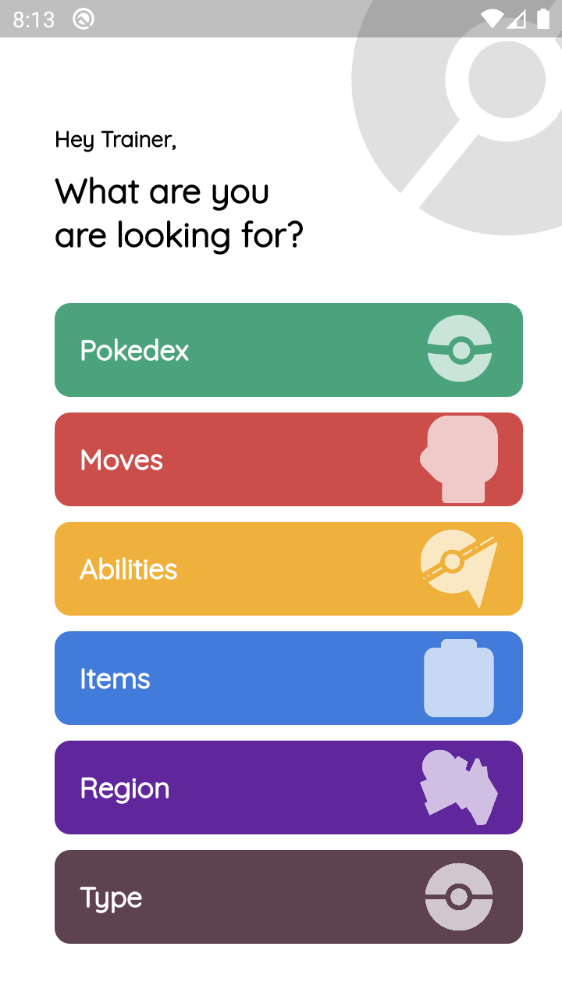
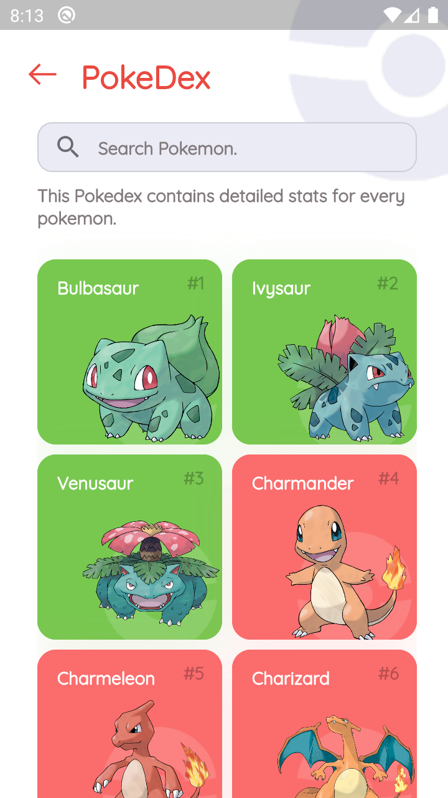
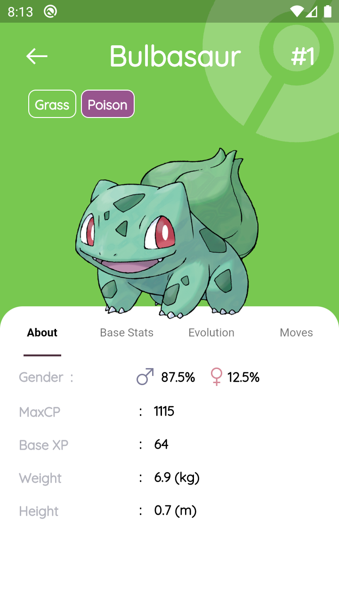
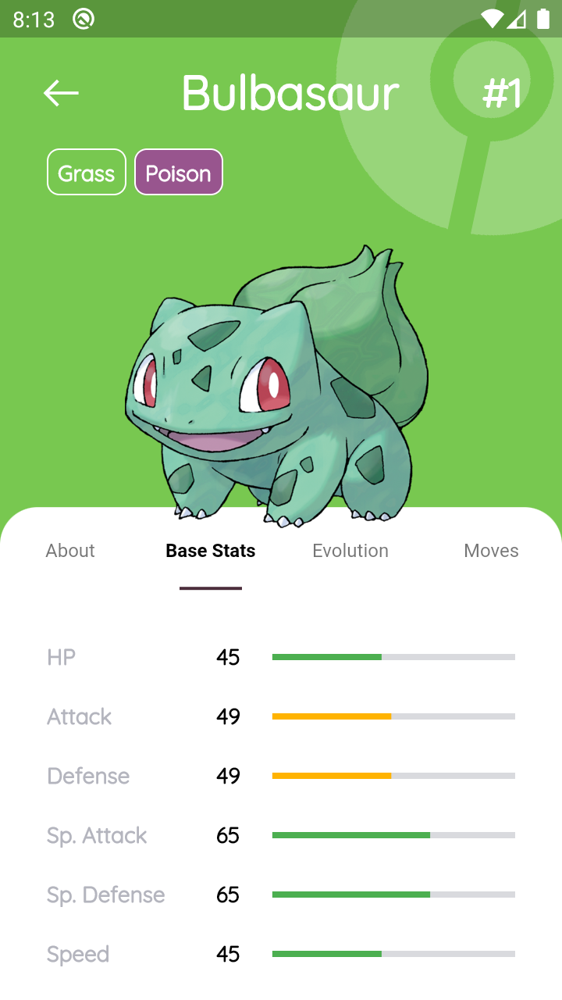

# PokeDex App - Flutter 
Pokemon Fan App Made in Flutter.
 
#### Supported features:
- PokeDex 
- Types
- PokeItems
- PokeMoves
- Poke Abilities
- PokeRegions

Test App by Downloading Apk From Screenshot/app.apk

#### Getting Started:

1. Clone/Download The Repo 
4. run ```flutter run ```

#### Screenshots:

 <br>
 

#### Credits:

- [Saepul Nahwane](https://dribbble.com/shots/6563578-Pokedex-App-Animation) - UI Inspired from here.
- FlatIcons & FreePik - For graphics
